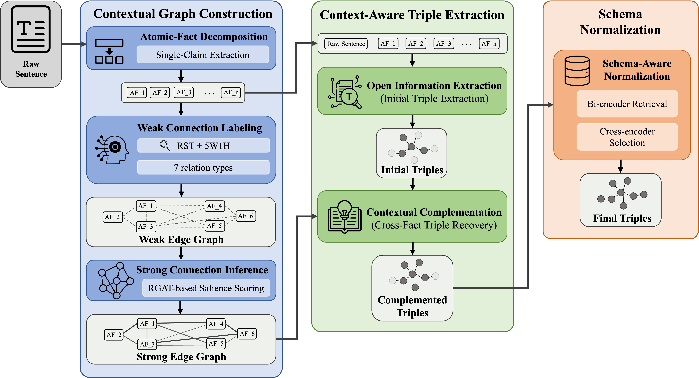

# Connectivity-Aware Knowledge Graph Construction for Complex Sentences

Official implementation for the paper **"Connectivity-Aware Knowledge Graph Construction for Complex Sentences"**.

This repository contains the code for a schema-aligned knowledge graph construction pipeline designed to improve triple extraction from complex sentences. The framework decomposes input sentences into atomic facts, models contextual connectivity across facts, extracts candidate triples, and normalizes relation expressions to a predefined target schema.

---

## Overview

Large language models and open information extraction systems often struggle with complex sentences containing multiple claims, dense syntax, and distributed contextual evidence. While atomic-fact decomposition can simplify extraction, it may also fragment contextual dependencies that are necessary for recovering complete relational triples.

To address this issue, this repository implements a **connectivity-aware knowledge graph construction pipeline** consisting of the following stages:

1. **Atomic Fact Decomposition**  
   Decompose a raw sentence into simpler atomic facts to improve local extractability.

2. **Inter-Fact Connectivity Modeling**  
   Recover contextual links between atomic facts to mitigate decomposition-induced context fragmentation.

3. **Open Information Extraction**  
   Extract candidate triples from the raw sentence and atomic facts.

4. **Contextual Complementation**  
   Use connectivity signals between atomic facts to recover additional triples that may not be extracted from isolated facts alone.

5. **Schema Normalization**  
   Align extracted open-vocabulary relation expressions to a predefined target relation schema.

The current implementation supports experiments on the following datasets:

- **REBEL**
- **Wiki-NRE**
- **WebNLG**

---

## Pipeline

The overall framework is organized around three major phases:

- **Contextual Graph Construction**  
  Atomic fact generation and inter-fact connectivity modeling

- **Context-Aware Triple Extraction**  
  Open information extraction and connectivity-based complementation

- **Schema Normalization**  
  Schema-aware relation alignment using predefined target schemas

If you include a pipeline figure in the repository later, it can be inserted here.

<!-- Example:
<p align="center">
  
</p>
-->

---

## Repository Structure

```bash
.
├── datasets/
│   ├── rebel.txt
│   ├── webnlg.txt
│   └── wiki-nre.txt
├── evaluate/
│   ├── references/
│   ├── evaluation_script.py
│   └── README.md
├── few_shot_examples/
│   ├── rebel/
│   ├── webnlg/
│   └── wiki-nre/
├── oie/
│   ├── __pycache__/
│   ├── preprocess/
│   ├── utils/
│   ├── __init__.py
│   ├── complementation.py
│   ├── framework.py
│   └── oie.py
├── outputs/
├── preprocess_outputs/
├── prompt_templates/
│   ├── oie_complementation.txt
│   └── oie.txt
├── schemas/
│   ├── rebel_schema.csv
│   ├── webnlg_schema.csv
│   └── wiki-nre_schema.csv
├── environment.yml
├── run.py
└── run.sh